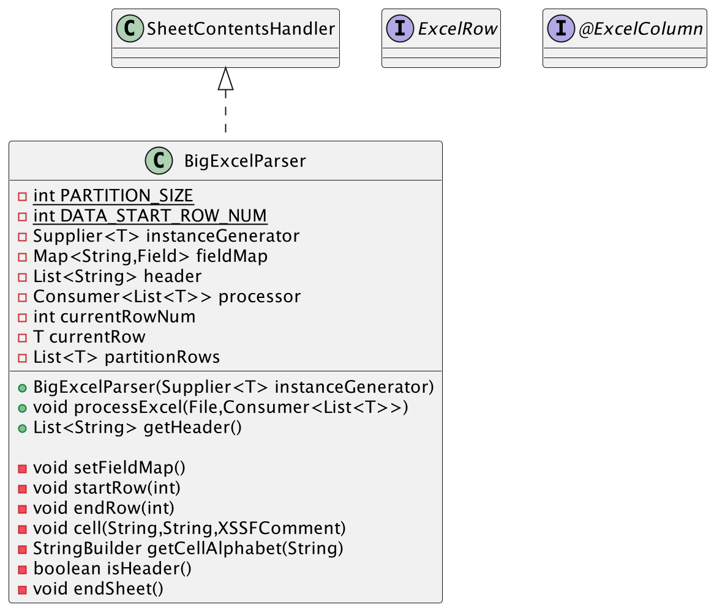

# BigExcelParser
## Concept
- BigExcelParser는 대용량 Excel File을 파싱하여 사용자가 원하는 후처리를 수행시킬 수 있는 파서입니다. 
- DOM(Document Object Model) 방식이 아닌 SAX(Simple API for XML) 방식으로 데이터를 읽고 처리할 수 있도록 설계하여 대용량 Excel 데이터를 파싱 하는데 적합합니다.
- Excel File 전체를 한번에 읽는 경우 파일 크기가 커짐에 따라 애플리케이션 서버에서 OOME(Out Of Memory Error)가 발생하여, 이를 해결하고자 개발하였습니다.

## Class Diagram
- BigExcelParser
  - 대용량 Excel File을 안정적으로 파싱하며, 작업 단위(Chunk Size)마다 사용자가 정의한 처리기를 수행시키는 파서
- ExcelRow
  - BigExcelParser를 사용하기 위해 구현해야하는 Marker Interface
- ExcelColumn
  - ExcelRow 구현체 클래스의 필드에 파싱을 위한 메타 데이터를 정의하는 어노테이션

  

## Usage
```java
@Slf4j
class BigExcelParserTest {

    @Test
    @DisplayName("ExcelFileReader 기본 사용법")
    @SneakyThrows
    void excelReadTest() {
        // given
        String filePath = "src/main/resources/simple.xlsx";
        File file = new File(filePath);
        List<Book> parsedBookList = new ArrayList<>();

        // when
        BigExcelParser<Book> bigExcelParser = new BigExcelParser<>(Book::new);
        bigExcelParser.processExcel(file, myProcessor(parsedBookList));

        // then
        assertThat(parsedBookList.size()).isEqualTo(5);
    }

    // Excel Data 를 Chunk Size 단위로 파싱한 뒤 수행 시키고 싶은 로직을 Consumer 로 작성
    private Consumer<List<Book>> myProcessor(List<Book> parsedBookList) {
        return (books) -> {
            log.info("partition process : {}", books.toString());
            parsedBookList.addAll(books);
        };
    }

    @Test
    @DisplayName("Excel Data 파싱 후에는 컬럼의 header 목록도 별도로 얻을 수 있다.")
    @SneakyThrows
    void getHeaderTest() {
        // given
        String filePath = "src/main/resources/simple.xlsx";
        File file = new File(filePath);

        BigExcelParser<Book> bigExcelParser = new BigExcelParser<>(Book::new);
        bigExcelParser.processExcel(file, (books) -> {});

        // when
        List<String> header = bigExcelParser.getHeader();

        // then
        assertThat(header.size()).isEqualTo(3);
        assertThat(header.get(0)).isEqualTo("번호");
        assertThat(header.get(1)).isEqualTo("도서명");
        assertThat(header.get(2)).isEqualTo("가격");
    }

    @Data
    @NoArgsConstructor
    private static class Book implements ExcelRow {

        @ExcelColumn(cellAlphabet = "A")
        private String No;

        @ExcelColumn(cellAlphabet = "B")
        private String title;

        @ExcelColumn(cellAlphabet = "C")
        private Double price;

    }

}
```

## Reference
#### DOM (Document Object Model)
> - DOM은 문서 객체 모델(Document Object Model)의 약자로, XML 또는 HTML 문서를 메모리에 로드하여 트리 구조로 표현하는 방법을 의미합니다. 
> - 이는 문서의 구조를 표현하는 표준화된 방법을 제공하여 프로그램이 문서의 구조, 콘텐츠 및 스타일에 대해 쉽게 조작할 수 있도록 합니다. 
> - DOM을 사용하면 문서의 요소, 속성, 텍스트 등에 대한 전체 구조를 메모리에 로드하여 쉽게 탐색하고 수정할 수 있습니다. 
> - 하지만 대용량 문서나 메모리 사용량이 큰 문서의 경우 성능이 저하될 수 있습니다.

#### SAX (Simple API for XML)
> - SAX는 단순 API for XML의 약자로, XML 문서를 이벤트 기반으로 파싱하는 방법을 의미합니다. 
> - SAX 파서는 XML 문서를 한 줄씩 읽어가면서 시작 태그, 종료 태그, 요소 내용 등의 이벤트를 발생시킵니다. 
> - 이러한 이벤트를 처리하는 콜백 메서드를 사용하여 XML 문서를 처리할 수 있습니다. 
> - SAX는 대용량 XML 문서나 스트림을 효율적으로 처리할 수 있으며, 메모리 사용량이 작기 때문에 대용량 문서도 처리할 수 있습니다. 
> - 그러나 DOM과는 달리 전체 문서를 메모리에 로드하지 않기 때문에 문서의 구조를 전체적으로 파악하기 어려울 수 있습니다.

